# 🚀 Memorae.ai Architecture Optimization Guide
## Advanced Multi-Agent System Design for Scalable WhatsApp Reminder Platform

---

## 📋 Executive Summary

This document presents a comprehensive architectural optimization for **Memorae.ai's WhatsApp-based reminder system**, transitioning from a linear agent chain to a sophisticated **Master-Slave Hierarchical Agent Pattern**. The proposed architecture addresses critical scalability, cost optimization, enhanced reasoning, and memory-augmented response capabilities.

---

## 🔍 Current Architecture Analysis

### System Overview
The current architecture follows a **linear agent chain pattern** with sequential processing through specialized agents.

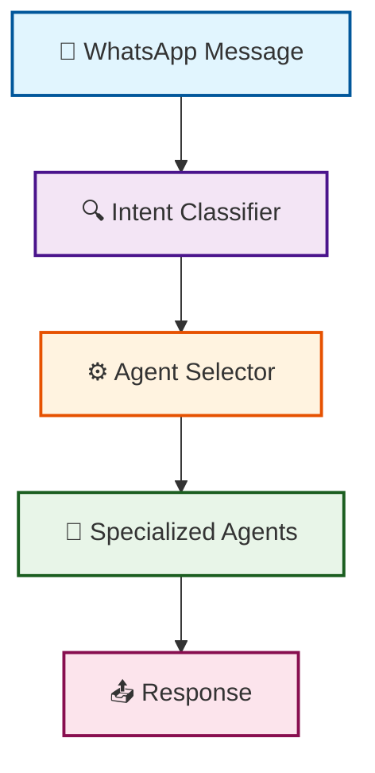

### Current Agents Identified

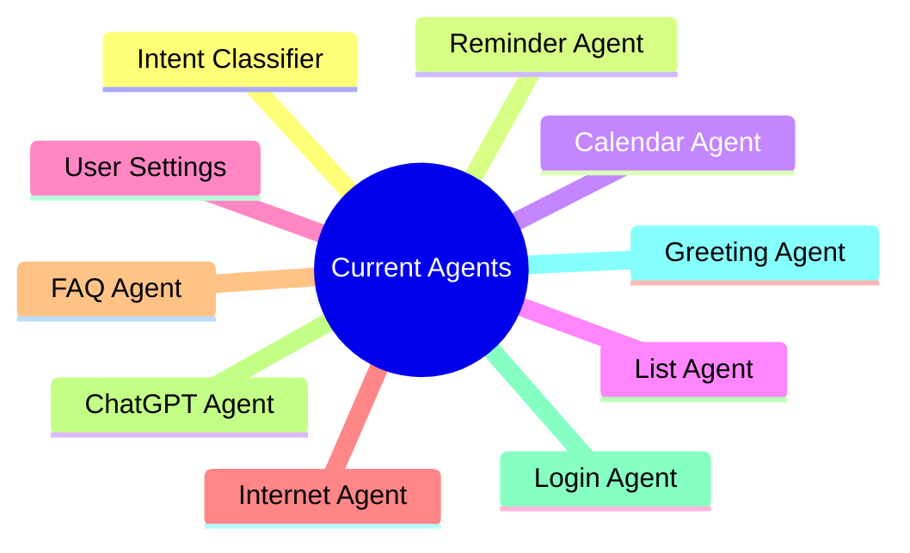

### ⚠️ Current Architecture Limitations

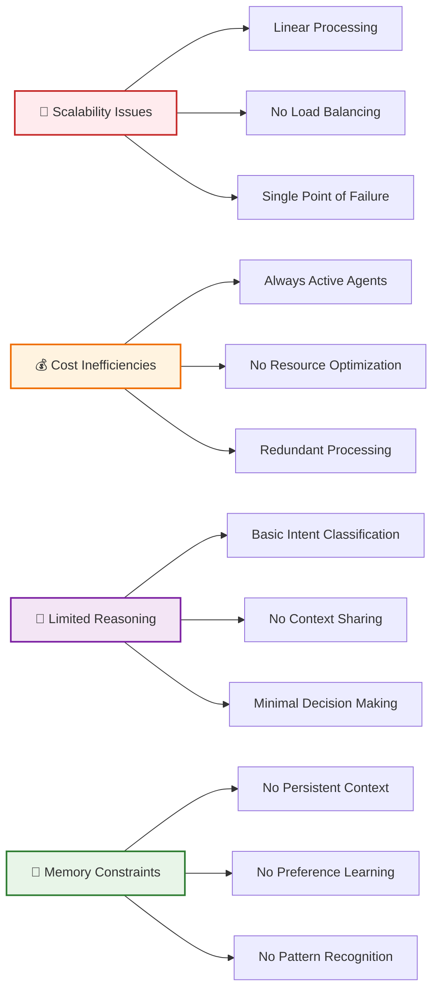

---

## 🏗️ Proposed Optimized Architecture

### Master-Slave Hierarchical Agent Pattern

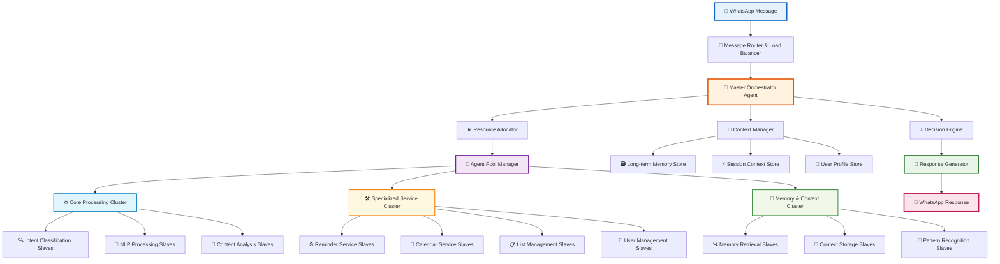

### Enhanced Message Processing Pipeline

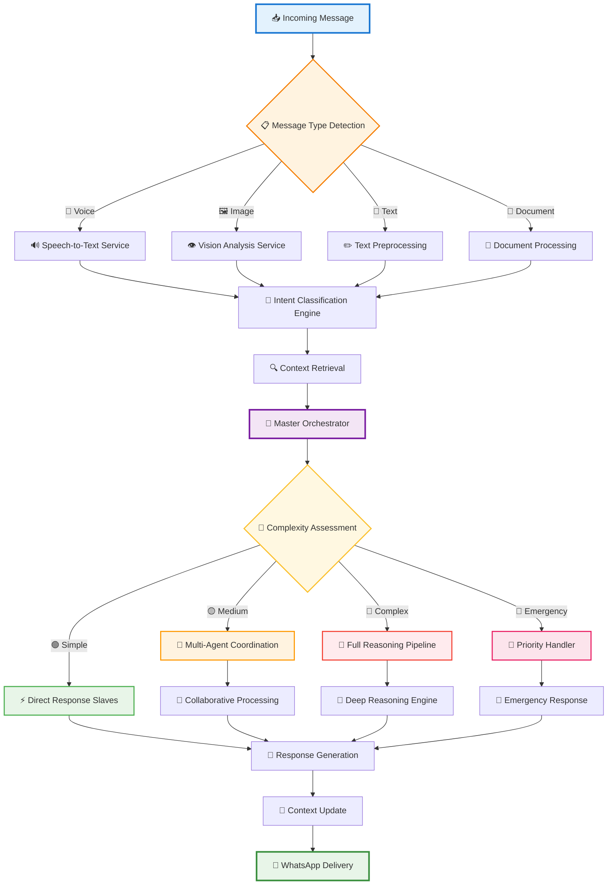

---

## 🧠 Enhanced Decision Engine

### Multi-Level Decision Flow

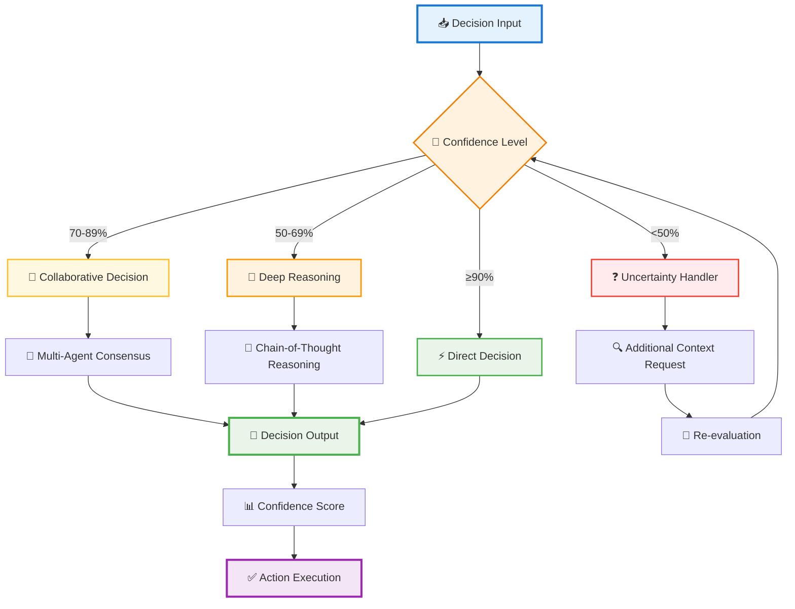

---

## 💾 Memory Architecture

### Hierarchical Memory System

```mermaid
flowchart TD
    A[🧠 Memory System] --> B[⚡ Tier 0: Ultra Fast]
    A --> C[🚀 Tier 1: Fast]
    A --> D[📚 Tier 2: Knowledge Base]
    A --> E[❄️ Tier 3: Cold Storage]
    
    B --> B1[💻 Working Memory<br/>RAM - <100ms]
    B --> B2[🔥 Hot Cache<br/>Redis - <100ms]
    B --> B3[⚡ Active Sessions<br/>Memory - <50ms]
    
    C --> C1[📊 Session Context<br/>PostgreSQL - <500ms]
    C --> C2[👤 User Profiles<br/>PostgreSQL - <300ms]
    C --> C3[🔄 Recent Interactions<br/>PostgreSQL - <400ms]
    
    D --> D1[🔍 Vector Database<br/>Pinecone - <1s]
    D --> D2[📚 Knowledge Base<br/>Elasticsearch - <800ms]
    D --> D3[📈 Pattern Database<br/>ClickHouse - <1.2s]
    
    E --> E1[📦 Archive Data<br/>S3 - >5s]
    E --> E2[📋 Historical Logs<br/>S3 - >3s]
    E --> E3[💾 Backup Data<br/>S3 - >10s]
    
    %% Tier styling
    style B fill:#e8f5e8,stroke:#4caf50,stroke-width:3px
    style C fill:#fff8e1,stroke:#fbc02d,stroke-width:3px
    style D fill:#fff3e0,stroke:#ff9800,stroke-width:3px
    style E fill:#e3f2fd,stroke:#2196f3,stroke-width:3px
    
    %% Component styling
    style B1 fill:#f1f8e9,stroke:#689f38,stroke-width:2px
    style B2 fill:#f1f8e9,stroke:#689f38,stroke-width:2px
    style B3 fill:#f1f8e9,stroke:#689f38,stroke-width:2px
```

### Memory Flow & Consolidation

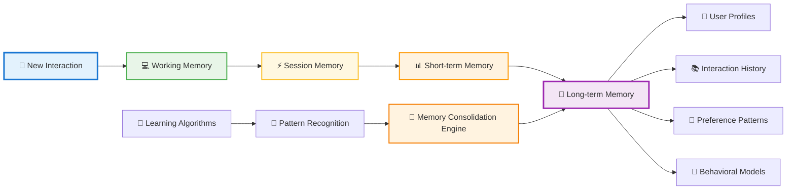

---

## 📈 Scalability Architecture

### Auto-Scaling Infrastructure

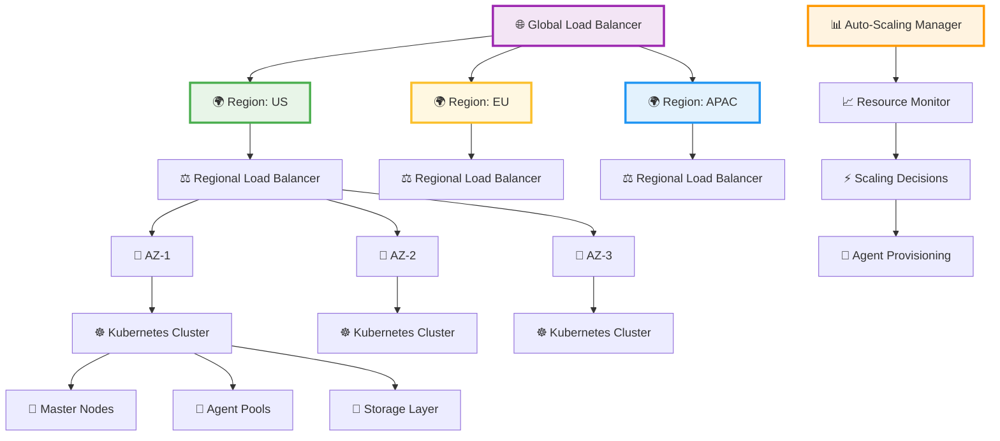

### Agent Pool Management

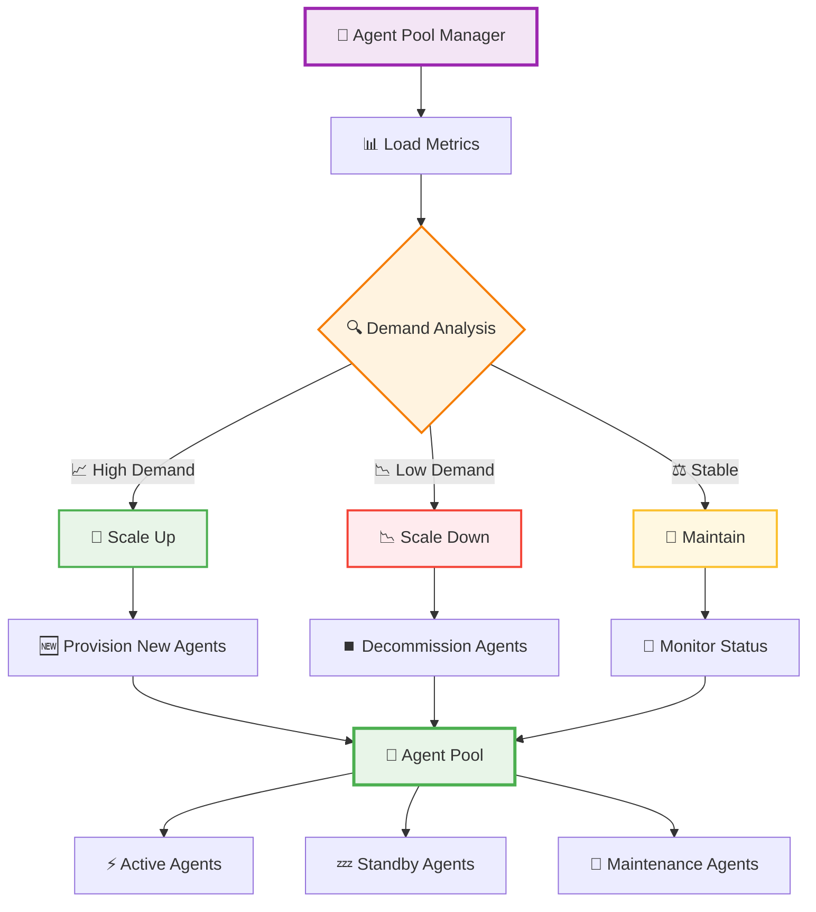

---

## 🔧 Implementation Roadmap

### Project Timeline

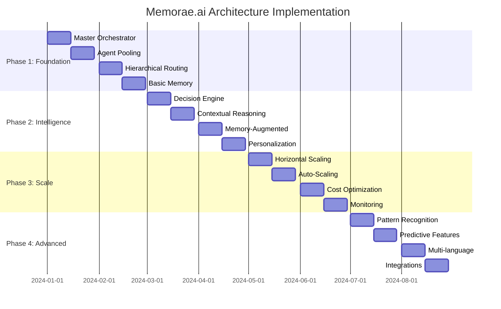

### Implementation Stages

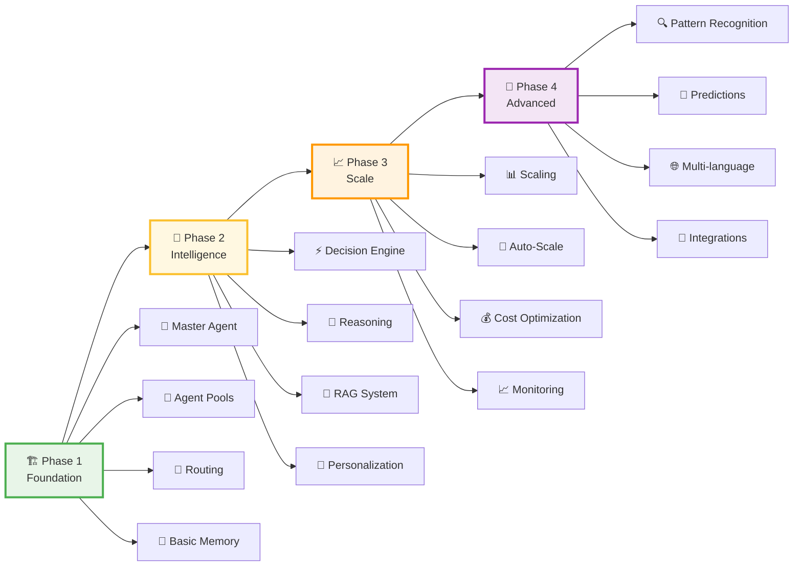

---

## 📊 Performance Metrics & KPIs

### Key Performance Indicators

```mermaid
flowchart TD
    A[📊 Performance Dashboard] --> B[⚡ Speed Metrics]
    A --> C[🎯 Accuracy Metrics]
    A --> D[💰 Cost Metrics]
    A --> E[📈 Scale Metrics]
    
    B --> B1[📈 Response Time<br/>Target: <1s]
    B --> B2[⚡ Processing Speed<br/>Target: 100 req/s]
    B --> B3[🔄 Throughput<br/>Target: 10K users]
    
    C --> C1[🎯 Intent Accuracy<br/>Target: >90%]
    C --> C2[✅ Response Quality<br/>Target: >85%]
    C --> C3[😊 User Satisfaction<br/>Target: >90%]
    
    D --> D1[💵 Cost per Request<br/>Target: <$0.02]
    D --> D2[⚙️ Resource Efficiency<br/>Target: >80%]
    D --> D3[📊 ROI<br/>Target: >200%]
    
    E --> E1[👥 Concurrent Users<br/>Target: 100K+]
    E --> E2[📈 Growth Rate<br/>Target: 50%/month]
    E --> E3[🌐 Global Availability<br/>Target: 99.9%]
    
    %% Category styling
    style B fill:#e8f5e8,stroke:#4caf50,stroke-width:3px
    style C fill:#fff8e1,stroke:#fbc02d,stroke-width:3px
    style D fill:#fff3e0,stroke:#ff9800,stroke-width:3px
    style E fill:#f3e5f5,stroke:#9c27b0,stroke-width:3px
```

### Cost-Benefit Analysis

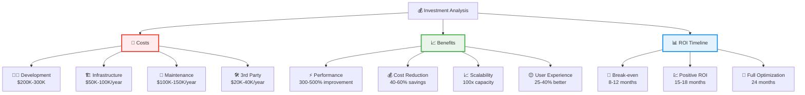

---

## 🛡️ Security & Compliance

### Security Architecture

```mermaid
flowchart TD
    A[🛡️ Security Framework] --> B[🔐 Data Protection]
    A --> C[🚪 Access Control]
    A --> D[📋 Compliance]
    A --> E[📊 Monitoring]
    
    B --> B1[🔒 Encryption at Rest<br/>AES-256]
    B --> B2[🌐 Encryption in Transit<br/>TLS 1.3]
    B --> B3[🗝️ Key Management<br/>HashiCorp Vault]
    B --> B4[🎭 Data Anonymization<br/>PII Masking]
    
    C --> C1[🎫 Authentication<br/>OAuth 2.0 + JWT]
    C --> C2[👤 Authorization<br/>RBAC]
    C --> C3[🔑 API Security<br/>Rate Limiting]
    C --> C4[🌐 Network Security<br/>VPC + Firewall]
    
    D --> D1[🇪🇺 GDPR Compliance<br/>Data Rights]
    D --> D2[📱 WhatsApp API<br/>Terms Compliance]
    D --> D3[🌍 Data Sovereignty<br/>Regional Storage]
    D --> D4[📋 Audit Logging<br/>Activity Trails]
    
    E --> E1[👁️ Security Monitoring<br/>SIEM]
    E --> E2[🚨 Threat Detection<br/>ML-based]
    E --> E3[🔍 Vulnerability Scanning<br/>Automated]
    E --> E4[📊 Security Metrics<br/>Dashboard]
    
    %% Category styling
    style B fill:#f3e5f5,stroke:#9c27b0,stroke-width:3px
    style C fill:#fff8e1,stroke:#fbc02d,stroke-width:3px
    style D fill:#e8f5e8,stroke:#4caf50,stroke-width:3px
    style E fill:#fff3e0,stroke:#ff9800,stroke-width:3px
```

---

## 🛠️ Technology Stack

### Infrastructure & Tools

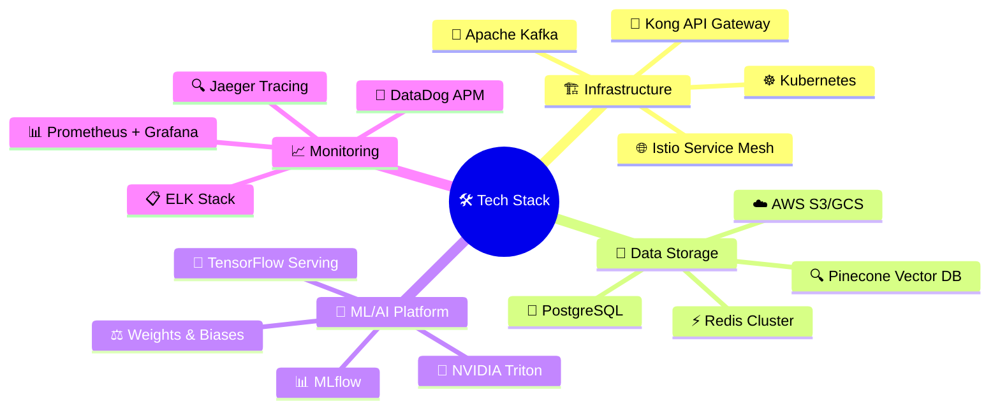

---

## 🎯 Next Steps & Action Items

### Immediate Actions (Next 30 Days)

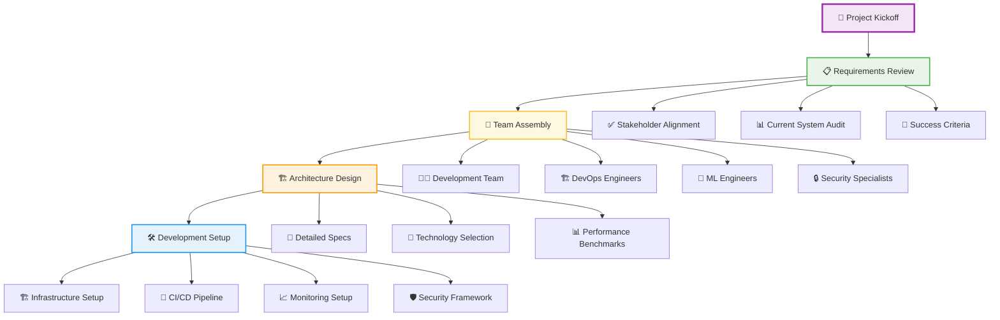

---

## 📝 Conclusion

The proposed **Master-Slave Hierarchical Agent Pattern** represents a significant architectural evolution for Memorae.ai. This optimization addresses current limitations while providing a foundation for future growth and enhanced capabilities.

### 🎯 Key Benefits Summary

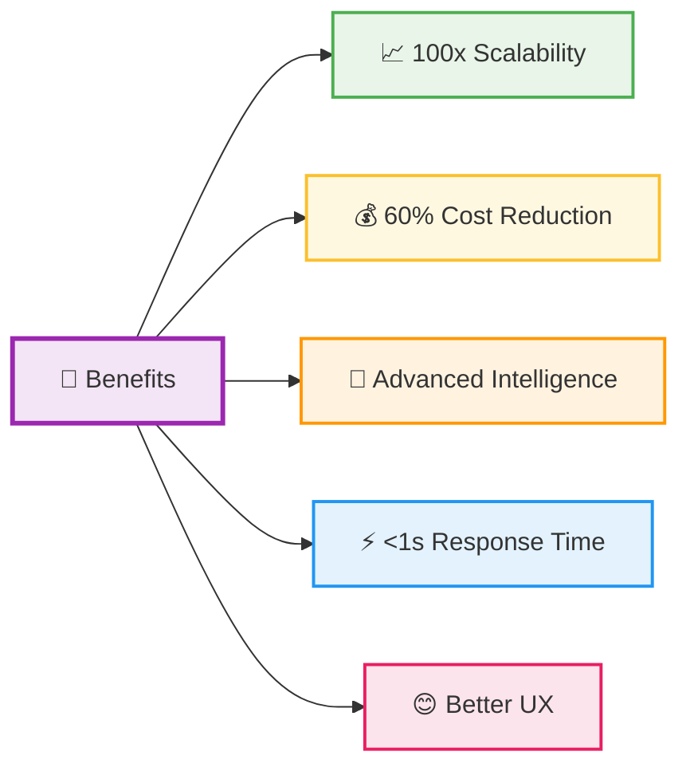

This architecture positions **Memorae.ai** as a leading AI-powered reminder platform capable of handling enterprise-scale deployments while maintaining exceptional user experience and cost efficiency.

---

## 📞 Contact & Support

For questions about this architecture guide or implementation support:

- 📧 **Email**: architecture@memorae.ai
- 💬 **Slack**: #memorae-architecture
- 📚 **Documentation**: docs.memorae.ai/architecture
- 🎯 **Project Board**: github.com/memorae/architecture-v2

---

*Last Updated: June 2025 | Version 2.0 | Status: Ready for Implementation* 🚀
