# 🚀 Memorae.ai Optimized Architecture Proposal
### Advanced Multi-Agent System Design for Scalable WhatsApp Reminder Platform

---

## 📋 Executive Summary
This proposal presents an optimized architecture for Memorae.ai's WhatsApp-based reminder system, moving from a linear agent chain to a hybrid Hierarchical Multi-Agent Architecture and Custom Multi-Agent Workflow. The design focuses on improving scalability, reducing latency, lowering costs, and enhancing user experience by introducing structured agent roles, selective communication, and dynamic resource management.

---

## 🔍 Current Architecture Analysis

### System Overview
The current architecture employs a linear agent chain where an incoming WhatsApp message passes sequentially through an Intent Classifier, Agent Selector, and a series of specialized agents (Reminder, Calendar, List, etc.) before generating a response. This sequential processing leads to inefficiencies.

### ⚠️ Current Limitations
*   **Scalability Issues:** Linear processing creates bottlenecks, with no load balancing or parallel execution.
*   **Cost Inefficiencies:** All agents are active for every task, leading to redundant resource usage.
*   **Latency:** Sequential execution increases response time, negatively impacting user experience.
*   **User Experience:** Limited context sharing and basic intent classification result in generic, less personalized responses.

---

## 🏗️ Proposed Optimized Architecture

### Selected Architecture Styles

#### Hierarchical Multi-Agent Architecture:
*   **Why Chosen:** Provides structured roles and supervision, enabling efficient task delegation and coordination. A top-level orchestrator manages specialized agents, reducing unnecessary agent invocations.
*   **Benefits:** Enhances scalability through layered control, reduces latency by parallelizing tasks, and lowers costs by activating only necessary agents.

#### Custom Multi-Agent Workflow:
*   **Why Chosen:** Allows selective communication between agents, ensuring only relevant agents are invoked for a task. This reduces overhead and improves user experience by streamlining workflows.
*   **Benefits:** Optimizes resource usage, minimizes latency, and supports tailored interactions for specific tasks.

### Optimized Architecture Design
The proposed architecture introduces a Master Orchestrator (Hierarchical) to oversee task delegation and a Custom Workflow Engine to define selective communication paths. Agents are grouped into clusters based on their roles, and a dynamic resource manager ensures cost efficiency.

```mermaid
flowchart TD
    A[📱 WhatsApp Message] --> B[🔀 Message Router & Load Balancer]
    B --> C[👑 Master Orchestrator Agent]

    C --> D[🧠 Context Manager]
    C --> E[⚡ Custom Workflow Engine]
    C --> F[📊 Dynamic Resource Manager]

    E --> G[🎯 Agent Cluster Selector]

    G --> H[⚙️ Core Processing Cluster]
    G --> I[🛠️ Specialized Service Cluster]
    G --> J[💾 Memory & Context Cluster]

    H --> H1[🔍 Intent Classification]
    H --> H2[📝 NLP Processing]

    I --> I1[⏰ Reminder Service]
    I --> I2[📅 Calendar Service]
    I --> I3[📋 List Management]
    I --> I4[👤 User Settings]

    J --> J1[🔍 Memory Retrieval]
    J --> J2[💽 Context Storage]

    D --> K[🗃️ Long-term Memory Store]
    D --> L[⚡ Session Context Store]

    F --> M[🤖 Agent Pool Manager]

    M --> N[⚡ Active Agents]
    M --> O[💤 Standby Agents]

    E --> P[📝 Response Generator]
    P --> Q[📱 WhatsApp Response]

    %% Styling
    style A fill:#e3f2fd,stroke:#1565c0,stroke-width:3px
    style C fill:#fff3e0,stroke:#e65100,stroke-width:3px
    style E fill:#f3e5f5,stroke:#7b1fa2,stroke-width:3px
    style P fill:#e8f5e8,stroke:#2e7d32,stroke-width:3px
    style Q fill:#fce4ec,stroke:#c2185b,stroke-width:3px

```

### Enhanced Message Processing Pipeline
The pipeline leverages the Custom Workflow Engine to classify message complexity and route tasks efficiently. Simple tasks are handled directly, while complex ones involve multiple agents in a coordinated manner.

```mermaid
flowchart TD
    A[📥 Incoming Message] --> B{📋 Message Type Detection}

    B -->|🎤 Voice| C[🔊 Speech-to-Text]
    B -->|🖼️ Image| D[👁️ Vision Analysis]
    B -->|📝 Text| E[✏️ Text Preprocessing]

    C --> F[🧠 Intent Classification]
    D --> F
    E --> F

    F --> G[🔍 Context Retrieval]
    G --> H[⚡ Custom Workflow Engine]

    H --> I{🎯 Task Complexity}

    I -->|🟢 Simple| J[⚡ Direct Response]
    I -->|🟡 Medium| K[🤝 Coordinated Agents]
    I -->|🔴 Complex| L[🧠 Multi-Agent Workflow]

    J --> M[📝 Response Generation]
    K --> M
    L --> M

    M --> N[💾 Context Update]
    N --> O[📱 WhatsApp Delivery]

    %% Styling
    style A fill:#e3f2fd,stroke:#1976d2,stroke-width:3px
    style H fill:#f3e5f5,stroke:#7b1fa2,stroke-width:3px
    style I fill:#fff8e1,stroke:#fbc02d,stroke-width:2px
    style O fill:#e8f5e8,stroke:#388e3c,stroke-width:3px
```

### 📈 Scalability Improvements
The hierarchical structure enables parallel task execution across agent clusters, while the Dynamic Resource Manager scales agent pools based on demand. Load balancing at the message router ensures even distribution of tasks across regions.

```mermaid
flowchart TD
    A[🌐 Global Load Balancer] --> B[🌍 Region: US]
    A --> C[🌍 Region: EU]

    B --> B1[⚖️ Regional Load Balancer]
    C --> C1[⚖️ Regional Load Balancer]

    B1 --> B2[🏢 Agent Cluster 1]
    B1 --> B3[🏢 Agent Cluster 2]

    B2 --> B4[☸️ Kubernetes Cluster]
    B4 --> B5[👑 Master Orchestrator]
    B4 --> B6[🤖 Agent Pools]

    %% Styling
    style A fill:#f3e5f5,stroke:#9c27b0,stroke-width:3px
    style B fill:#e8f5e8,stroke:#4caf50,stroke-width:3px
    style C fill:#fff8e1,stroke:#fbc02d,stroke-width:3px
```

### ⚡ Latency Reduction
*   **Parallel Processing:** The hierarchical structure allows parallel task execution, significantly reducing response time.
*   **Selective Agent Invocation:** The Custom Workflow Engine ensures only necessary agents are activated, minimizing processing overhead.
*   **Context Caching:** The Memory & Context Cluster stores session data for quick retrieval, avoiding redundant computations.

### 💰 Cost Efficiency
*   **Dynamic Resource Allocation:** The Dynamic Resource Manager activates agents only when needed, reducing idle resource usage.
*   **Selective Workflows:** Limiting agent interactions avoids unnecessary processing, lowering operational costs.
*   **Scalable Infrastructure:** Kubernetes-based clusters enable efficient resource scaling, optimizing costs during low-demand periods.

### 😊 Enhanced User Experience
*   **Context Awareness:** The Context Manager maintains session and long-term memory, enabling personalized and relevant responses.
*   **Faster Responses:** Reduced latency through parallel processing and selective workflows improves user satisfaction.
*   **Accurate Intent Handling:** Advanced intent classification and coordinated workflows ensure precise and contextually appropriate responses.

### ⚙️ Key Technical Enhancements
To further optimize performance and accuracy, the proposed architecture will incorporate several advanced techniques:

*   **Multi-Level Caching:** Implementing a sophisticated caching strategy at various layers to dramatically reduce redundant computations and data retrieval times.
    *   **Session-Level Cache:** Caching user context, recent messages, and frequently accessed data within a single session for near-instant retrieval.
    *   **Agent-Level Cache:** Caching the outputs of deterministic agents for common inputs (e.g., "what is the time?").
    *   **Global Knowledge Cache:** Caching results from external API calls or database lookups that are not user-specific.

*   **Semantic Routing:** Moving beyond simple intent classification, semantic routing will use vector embeddings to understand the underlying meaning of a user's request. The Master Orchestrator will route the request not based on keywords, but on its semantic similarity to the capabilities of specialized agent clusters, ensuring more accurate and nuanced task delegation.

*   **Vector DB Reranking for Context Retrieval:** To enhance context awareness, we will improve our memory retrieval process from the vector database. This involves a two-stage process:
    1.  **Initial Retrieval:** A fast, broad search in the vector DB to retrieve a set of potentially relevant memories or documents.
    2.  **Reranking:** A more sophisticated, computationally intensive model (like a cross-encoder) is then used to re-rank the top results from the initial retrieval. This ensures that the most contextually relevant information is prioritized and passed to the agents, leading to highly accurate and personalized responses.

### 📊 Performance Metrics
The new architecture targets the following improvements:

*   **Response Time:** <1s (from current 3-5s)
*   **Concurrent Users:** 50K+ (from current 5K)
*   **Cost per Request:** Reduced by 50% through selective agent invocation
*   **User Satisfaction:** >90% (from current 75%)

---

## 📝 Conclusion
The hybrid Hierarchical Multi-Agent Architecture and Custom Multi-Agent Workflow effectively addresses Memorae.ai's current limitations by improving scalability, reducing latency, lowering costs, and enhancing user experience. This design positions Memorae.ai for enterprise-scale growth while maintaining efficiency and user satisfaction.
